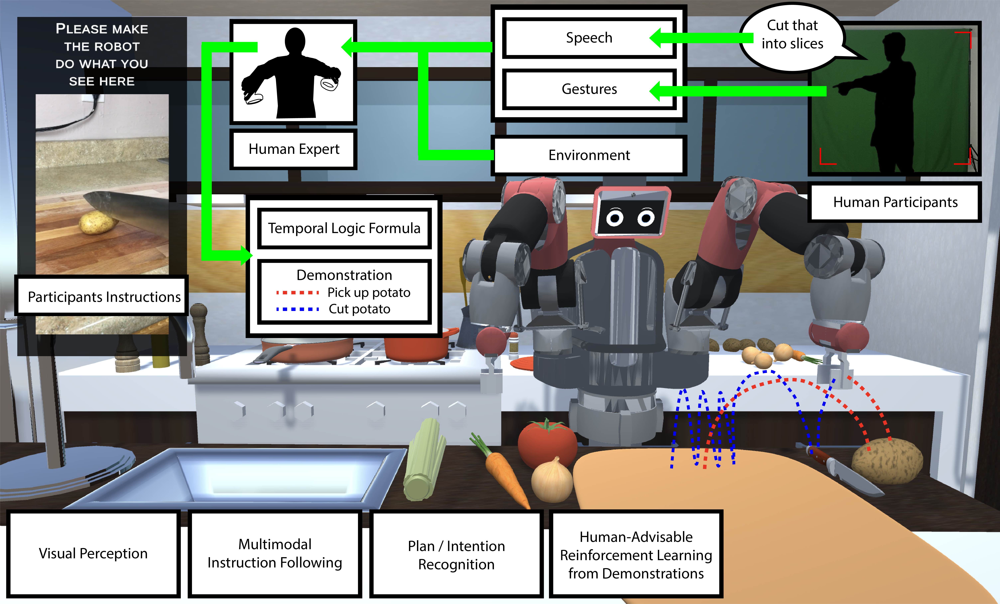

# NatSGLD
A Dataset with Speech, Gesture, Logic, and Demonstration for Robot Learning in Natural Human-Robot Interaction

- [NatSGLD Website](https://www.snehesh.com/natsgld)
- [NatSGLD Paper (Coming Soon!)](#)

## Dataset Overview


## Demo Videos

#### Overview Video
<video src="demo/NATSGLD-Demo-Video-Compressed.mp4" width="960" height="540" controls></video>

#### Speech and Gesture to LTL Video
<video src="demo/NatSGLD_Sample_SpeechGestureLTL_Compressed.mp4" width="960" height="540" controls></video>


## Dataset Details

- **Metadata (.csv)**:
    
    The [metadata, stored as a CSV file](data/natsgld_metadata_v1.1.csv), serves as the primary database. Each record corresponds to a command issued by participants, identified by a unique global record number (DBSN) and participant ID (PID). The sequence number of commands within a session is recorded as SSN. The onset (start time, ST) and offset (end time, ET) of each command are provided in milliseconds from the start of the experiment, and the presence of speech or gestures is indicated by a boolean value (1 for presence, 0 for absence).
    
- **Videos (.mp4)**:
    
   Each video file names are named by participant ID (PID) (e.g., P41, P45, P50 etc.), two digit session sequence ID (SID) (eg. 01, 02, 03 etc.), and four digit overall database serial number (DBSN) (eg. 0001, 0099, 1234, etc.). An example filename of a video with `PID 40`, `SID 20`, and `DBSN 21` would be `P40-20-0021.mp4`. The videos contain the following:
    - Participants View: Audio at 44kHz and video at 30fps
    - Experiments View: Video at 30fps
    - Multicam Room View: Video at 30fps
    - Robot's First-Person (Ego) View: Video at 30fps, including RGB and depth images, instance segmentation maps (e.g., Onion1, Knife), and category segmentation maps (e.g., food, utensils, robot)
  
- **Events (.dat):**
    Events refer to key activities during the experiments, including participant speech (transcribed as text), human gesture videos, tasks or subtasks, object state changes (e.g., object grabbed, cut), and robot actions (tasks or subtasks performed). All events were annotated using [FEVA](https://www.snehesh.com/feva/) and stored in `.dat` format, following a JSON structure. Each event is identified by a unique 16-character alphanumeric UUID (annotation ID), with start and end times in milliseconds and annotation text. Robot actions can involve task performance or social interactions.

- **States (.npz)**:
    
    State data is stored as compressed numpy files, with PID as the primary key and DBSN as the secondary key. The states include robot and object data. Robot states capture location (orientation and translation), joint states (single angle for the head, 7 angles for each arm in radians), and 2D bounding boxes of objects in the robot's ego-view (object ID, starting x and y coordinates, width, and height in pixels). Object states are one-hot encoded for objects whose state has changed, with detailed descriptions available in the events `.dat` file.
    
- **Features (.npz)**:
    
    Features are stored as compressed numpy files, comprising embeddings and annotations, with PID as the primary key and DBSN as the secondary key. Each speech command includes [GloVe](https://nlp.stanford.edu/projects/glove/) and [BART](https://huggingface.co/docs/transformers/model_doc/bart) embeddings, while gestures use [OpenPose's 25 keypoints](https://github.com/CMU-Perceptual-Computing-Lab/openpose/blob/master/doc/02_output.md#pose-output-format-body_25). Gaze data use [L2CS-Net](https://github.com/Ahmednull/L2CS-Net) format, see [Gaze README](scripts/data-postprocess/gaze/README.md) for more details. Tasks are represented in text as [LTL](https://en.wikipedia.org/wiki/Linear_temporal_logic) formulas.

## Data Loading

#### Loading States and Features

**Description**
If you look in [load_data_sample.py](scripts/data-evaluate/load_data_sample.py), it is pretty simple to load the data using numpy `data = np.load...` then `data[0]` is your first command, robot response, etc. Then `data[1]` is your next data and so on.

The fields you will care about are:
**Speech**: Text of the speech
**Gesture**: Array of human 2d pose sequence of the gestures
**HasSpeech**: 1 or 0 if this command has speech or not
**HasGesture**: has gesture or not
**Start_Frame**: Image name of the what the robot sees when the command was given
**Stop_Frame**: Image name of what the robot sees when the task was completed
**BaxterState**: Robot motor angle sequences for each task completed
**BBox_One_Hot_Encoding**: one hot encoding of the objects that the command referred to and the robot interacted with
**BBoxes**: Bounding boxes of all the objects visible (format object instance there are total of 17 objects, and x1,y1,x2,y2) 

**Code**

```python
import numpy as np
dataset = np.load('data/states_and_features/natsgld_states_and_features_v1.0_sample.npz', allow_pickle=True)['NatComm'].item()

# Pariticipants
print(dataset.keys())

OUTPUT >> dict_keys([40, 45, 49, 51, 52, 53, 54, 55, 56, 57, 58, 59, 60, 61, 62, 63, 64, 70])

p40 = dataset[40]

# Show all keys
print(p40.keys())
OUTPUT >> dict_keys(['tdUEHP6Z8TATRsvicJS7cy2JhUJpIeCe', 'tznNogt30s9RhnohZmbjuDqliNAvSoMQ', ... ])

# See a sample data
print(p40['tdUEHP6Z8TATRsvicJS7cy2JhUJpIeCe'])

# OUTPUT FORMAT: [ DBSN, SID, Start Time, End Time, Sudo Speech, Has Speech, Has Gesture, Action, Object, { Speech UID: [ Start time, End time, Speech, [ Glove Embedding for each word ] ]}, { 'gesture_keypoints' : [ OpenPose keypoints ] }, { 'gesture_info': [...] } ]
OUTPUT >> [1129, 27, 416300, 418749, 'turn back', 1, 1, 'on', 'gas', {'Lq9pA5GDkCvZjOts1YaP7pAlvOoiblUV': [416700, 417800, 'so turn back', [array([ ...], dtype=float32), array([ ... ], dtype=float32), array([ ...], dtype=float32)]]}, {'gesture_keypoints': array([[..., [653, 245, 680, ..., 604, 671, 596]]]), 'gesture_info': [1.0, 1.0, 'RH|', 0.0, nan, 0.0, nan]}]

```

#### Loading LTL

```python
import numpy as np
dataset = np.load('data/states_and_features/natsgld_LTL_v1.0_sample.npz', allow_pickle=True)

print(dataset.files)
OUTPUT >> ['data', 'fields']

print(dataset['fields'])
OUTPUT >>  array(['DBSN', 'PID', 'SID', 'Speech', 'Gestures', 'Gestures_len', 'LTL', 'GTA', 'GTO'], dtype='<U12')

# load data
data = dataset['data']

# print sample data shape
print(data.shape)
OUTPUT >>  (734, 9)

# See a sample data
print(data[0])

# OUTPUT FORMAT:
# [ 
#     DBSN,         # Database Sequence Number
#     PID,          # Participant ID
#     SID,          # Session ID
#     Speech,       # Text of the speech
#     Gesutrues,    # Array of human 2d pose sequence of the gestures
#     Gestures_len, # Length of gestures (frames) 
#     LTL,          # Linear Temporal Logic
#     GTA,          # Ground Truth Action
#     GTO           # Ground Truth Object
# ]

OUTPUT >> array([1, 40, 0, 'turn on the burner under the water',
       tensor([[0.4857, 0.5485, 0.7624,  ..., 0.6309, 0.5376, 0.8944],
               [0.4857, 0.5457, 0.7569,  ..., 0.6310, 0.5376, 0.8997],
               [0.4857, 0.5484, 0.7587,  ..., 0.6355, 0.5376, 0.9033],
               ...,
               [0.4808, 0.5512, 0.7859,  ..., 0.6115, 0.5350, 0.8691],
               [0.4808, 0.5511, 0.7738,  ..., 0.6116, 0.5350, 0.8658],
               [0.4808, 0.5512, 0.7821,  ..., 0.6163, 0.5375, 0.8570]]),
       94,
       'X ( F ( C_StovePot U StovePot ) & G ( C_StovePotKnob U StovePotKnob ) & F ( StovePotKnob U Stove_On ) )',
       'on', 'gas'], dtype=object)
```


## NATSGLD Simulator
NATSGLD Simulator is located in the `natsgld-simulator` folder. The simulator works on Windows, Mac, or Linux.

### Simulator Prerequisites

#### Install Blender
- Download and Install Blender (v2.79a) https://download.blender.org/release/Blender2.79/


#### Install Unity
1. Install the latest **UnityHub**
https://unity.com/download

2. Download and install **Unity** 2019.3.0a5
https://unity.com/releases/editor/alpha/2019.3.0a5
   1. Windows https://download.unity3d.com/download_unity/9aff892fb75b/Windows64EditorInstaller/UnitySetup64-2019.3.0a5.exe
   2. Mac https://download.unity3d.com/download_unity/9aff892fb75b/MacEditorInstaller/Unity-2019.3.0a5.pkg
   3. Linux https://download.unity3d.com/download_unity/9aff892fb75b/LinuxEditorInstaller/Unity-2019.3.0a5.tar.xz


#### Install ROS
Validated on Linux Only. We also validated with Windows WSL Ubuntu. But there are firewall configuration you might have to make changes to allow socket communications.
- Install ROS version (ROS 1 Noetic) http://wiki.ros.org/noetic
- Install ROS Bridge Package http://wiki.ros.org/rosbridge_suite


#### Install ROS Sharp
- Clone ROS# (pronounced ROS-Sharp) from https://github.com/siemens/ros-sharp
- Copy `unity_simulation_scene` folder from `ros-sharp/ROS/unity_simulation_scene` into ROS workspace `src` folder
- Copy `ng.launch` from `natsgld-simulator/PreReq/` into ROS `unity_simulation_scene` package `launch` folder.
- Build ROS using `catkin_make`

#### Install BioIK

BioIK is a biologically-inspired evolutionary algorithm for solving inverse kinematics problems. There are two ways to use it:
1. [Purchase from the Unity3D Asset Store](https://assetstore.unity.com/packages/tools/animation/bio-ik-67819), or
2. [Standalone C++ and ROS Implementation](https://github.com/TAMS-Group/bio_ik)

In our work, we purchased BioIK from the Unity3D store, so if you wish to use the simulator without any modifications, please purchase BioIK and copy the package into the Assets folder or follow the latest BioIK installation instructions.

##### Saving and Loading BioIK solutions
For consistency and speed, you can save and load IK solutions from previous iterations. If you wish to save evolutionarily generated IK solutions or load the saved solutions, you will need to make a few modifications to the code. Please add the following changes to the `BioIK.cs` code once you import the BioIK asset.

**BioIK.cs**
```CS
public class BioIK : MonoBehaviour {
    ...
    [SerializeField] public bool EnableAutoIK = true;
    public bool OptimalSolutionExists = false;
    public double[] OptimalSolution = null;
    ...
    void LateUpdate() {
        ...
        if (EnableAutoIK) {
            if (OptimalSolutionExists) {
                /* Load Optmial Solution */
                Solution = OptimalSolution;
                
                /* Uncomment this if you want to re-optimize everytime */
                // Solution = Evolution.Optimise(Generations, Solution);
            }
            else {
                Solution = new double[Evolution.GetModel().MotionPtrs.Length];
                for (int _i = 0; _i < Evolution.GetModel().MotionPtrs.Length; _i++) {
                    Solution[_i] = Evolution.GetModel().MotionPtrs[_i].Motion.GetTargetValue(true);
                }
                Solution = Evolution.Optimise(Generations, Solution);
            }

            for (int _i=0; _i< Solution.Length; _i++) {
                BioJoint.Motion motion = Evolution.GetModel().MotionPtrs[_i].Motion;
                motion.SetTargetValue(Solution[_i], true);
                ...
            }
        }
        ...
    }
}
```

#### Image Synthesis

We use and modify [Image Synthesis Unity3D asset](https://github.com/U3DC/Image-Synthesis-for-Machine-Learning) distributed under MIT/X11 license to generate RGB, Depth, and Segmentation images.


### Simulator Setup
- From UnityHub click the `Open` button and browse to `natsgld-simulator` folder to open the project
- After the HRI simulator is open, go to the `Hierarchy` tab, click on the `OneSceneAnimation > ROS > RosConnector`. Then under the inspector tab, in ROS Connector, you will see `ROS Bridge Server URL` field with a value of `ws://ip_address:port_number` such as `ws://192.168.1.61:9090`. This is used to communicate with the ROS core via ROS Bridge.
- For ROS connectivity, you will need to find the IP address where the ROS core will be running. It can run on the same machine, virtual machine, or another computer within the same network. Change the IP address in the server URL to this IP Address. Keep the port 9090 unless you explicitly change this port number.
- You might get a prompt for `TextMesh Pro`. This is used for text overlay at run time. Go to the `Project` tab, right click `Packages` and select `View Package Manager`. In the package manager tab, install `TextMesh Pro` version `2.0.1`. Download any dependencies this package might prompt you for.

## Citation
Please cite our work if you find our research, paper, code, or any part of our work useful in your research or, if you use our dataset.

```
@inproceedings{shrestha2025natsgld,
  title     = {{NatSGLD}: A Dataset with {S}peech, {G}estures, {L}ogic, and Demonstrations for Robot Learning in {Nat}ural Human-Robot Interaction},
  author    = {Snehesh Shrestha, Yantian Zha, Saketh Banagiri, Ge Gao, Yiannis Aloimonos, Cornelia Fermüller},
  year      = {2025},
  booktitle={2025 20th ACM/IEEE International Conference on Human-Robot Interaction (HRI)}
}
```
